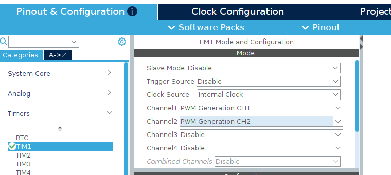
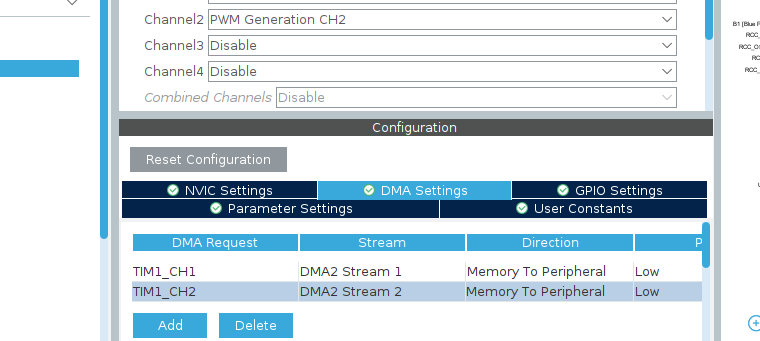

# stm32-ws2812-dma-chained
A high-performance C library for driving multiple WS2812 LED strands on STM32 using a chained DMA approach. Minimizes CPU overhead by sequentially updating strips via PWM and DMA callbacks.

## Table of Contents
1. [Components](#components)
2. [STM32CubeMX Setup](#stm32cubemx-setup)
3. [Library Details](#library-details)
4. [Bit Timing Logic](#bit-timing-logic)
5. [How-To](#how-to)
    - [Initialization](#initialization)
    - [Connect Callback](#connect-callback)
    - [Setting LED](#setting-led)
    - [Update Chain](#update-chain)
6. [Example](#example)
7. [Important: Advanced Timers](#important-advanced-timers)
8. [Support me](#support-me)

## Components
- STM32 Microcontroller (e.g., F446RE)
- WS2812B LED Strands (NeoPixel)

## STM32CubeMX Setup
The Hardware Abstraction Layer (HAL) must be configured precisely for the timing to work.

### Timer & Channel Configuration
To drive multiple strands, you can either use multiple channels on the **same timer** or use **different timers**. The library handles the sequence regardless of the hardware source.

- **Prescaler:** `0` (Maximum resolution)
- **Counter Mode:** `Up`
- **Period (ARR):** `61` (For 50 MHz Clock to reach **800 kHz**)
    - *Formula:* $ARR = (\text{TimerClock} / 800,000) - 1$
- **PWM Generation:** `PWM Mode 1`, Polarity `High`


Fig1: Config Timer e.g. TIM1 for two strands

#### Multi-Strand Setup Logic:
* **One Timer, Multiple Channels:** Assign each strand to a unique channel (e.g., `TIM1_CH1` for Strand 1, `TIM1_CH2` for Strand 2). This is the most efficient way to use hardware resources.
* **Multiple Timers:** If you run out of channels on one timer, you can define strands on a different timer (e.g., `TIM2_CH1`). 
* **Independent Pins:** Each defined `WS2812_Strand` must be connected to the specific GPIO pin associated with its assigned Timer/Channel.

> **Important:** Ensure that every Channel used is configured with its own **DMA Request** in CubeMX (Memory-to-Peripheral).gh`

### DMA Configuration
- **DMA Request:** Select specific channels (e.g., `TIM1_CH1`, `TIM1_CH2`)
- **Direction:** `Memory To Peripheral`
- **Mode:** `Normal` (The library handles the chain sequence)
- **Data Width:** `Half Word` (16-bit) for both Peripheral and Memory
- **Increment Address:** `Memory` (Checked)


Fig2: DMA Config for two Channels

### NVIC
- **NVIC:** Enable **DMA Global Interrupt**. (normally enabled automatically by DMA Config)

## Library Details
The library utilizes a non-blocking DMA chaining mechanism. Once a strand finishes its transfer, the `PulseFinishedCallback` triggers the next strand in the sequence.

- **Dynamic Timing:** Pulse widths for "1" and "0" bits are calculated automatically based on the `ARR` value.
- **Color Depth:** 24-bit GRB per LED.

## Bit Timing Logic
The library calculates high/low times based on the Timer Period ($ARR + 1$):
- **Period:** $ARR + 1$ (e.g., 62 Ticks @ 50 MHz)
- **Logical "1":** $\approx 66\%$ duty cycle $\rightarrow$ `(period * 2) / 3`
- **Logical "0":** $\approx 33\%$ duty cycle $\rightarrow$ `(period * 1) / 3`

## How-To

### Initialization
Define your LED buffers and strand structures in `main.c`:

```c
#define STRAND1_LEDS 2
#define STRAND2_LEDS 12

// Buffers: (24 bits * NumLEDs) + Reset Pulse (60)
uint16_t b1[24 * STRAND1_LEDS + WS2812_RESET_PULSE] = {0};
uint16_t b2[24 * STRAND2_LEDS + WS2812_RESET_PULSE] = {0};

// Strand definitions
WS2812_Strand s1 = {&htim1, TIM_CHANNEL_1, b1, STRAND1_LEDS, 24 * STRAND1_LEDS + WS2812_RESET_PULSE};
WS2812_Strand s2 = {&htim1, TIM_CHANNEL_2, b2, STRAND2_LEDS, 24 * STRAND2_LEDS + WS2812_RESET_PULSE};

// The chain array defines the sequence of the DMA transfer
WS2812_Strand* myChain[] = {&s1, &s2};
```

### connect callback
To enable the chaining mechanism (moving from one strand to the next), you must forward the Timer PWM callback to the library in your `main.c`:

```c
void HAL_TIM_PWM_PulseFinishedCallback(TIM_HandleTypeDef *htim)
{
    // Pass the signal to the library to handle the next strand in the chain
    WS2812_HandleCallback(htim);
}
```

### Setting LED
```c
// Example: Setting colors for Strand 1 and Strand 2 by color or pixel
WS2812_SetColor(&s1, 0, COLOR_ORANGE, 128); // LED 0: Orange, 50% brightness
WS2812_SetPixel(&s2, 0, 0, 255, 0, 255);    // LED 0: Pure Green, full brightness
WS2812_SetColor(&s2, 1, COLOR_RED, 128);    // LED 1: Red, 50% brightness
```

### Update chain
WS2812_StartChain(myChain, 2);


### Example
Take a look at the example for nucleo f446re in the repo.

When using **Advanced Control Timers** (such as **TIM1** or **TIM8**) on STM32, the PWM signals will not reach the output pins by default, even if the DMA and Timer are running correctly. 

You must manually enable the **Main Output Enable (MOE)** bit. Without this step, the pins remain in a high-impedance state, and no signal will be visible on an oscilloscope or the LEDs.

Add the following line to your `main.c` inside the initialization section:

```c
/* USER CODE BEGIN 2 */
// Required for TIM1 and TIM8 to enable physical signal output
__HAL_TIM_MOE_ENABLE(&htim1); 
/* USER CODE END 2 */
```

## Support me
If you find this project helpful and would like to support my work, I would be very grateful for a contribution via GitHub Sponsors or in Bitcoin (BTC) / Litecoin (LTC). Every bit of support helps me to keep creating and sharing new projects. Thank you!

### LTC:
ltc1qx2yf4cndqr2zf3vfd7l2ywm5hylvhm0a8jrxry


### BTC: 
bc1qd2n20g6phmnkxcdhrznqfes3mdxefpslywy67v


